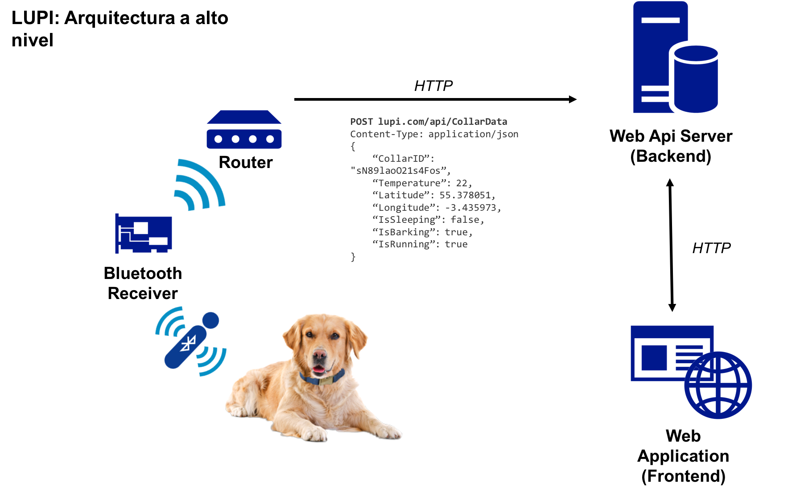
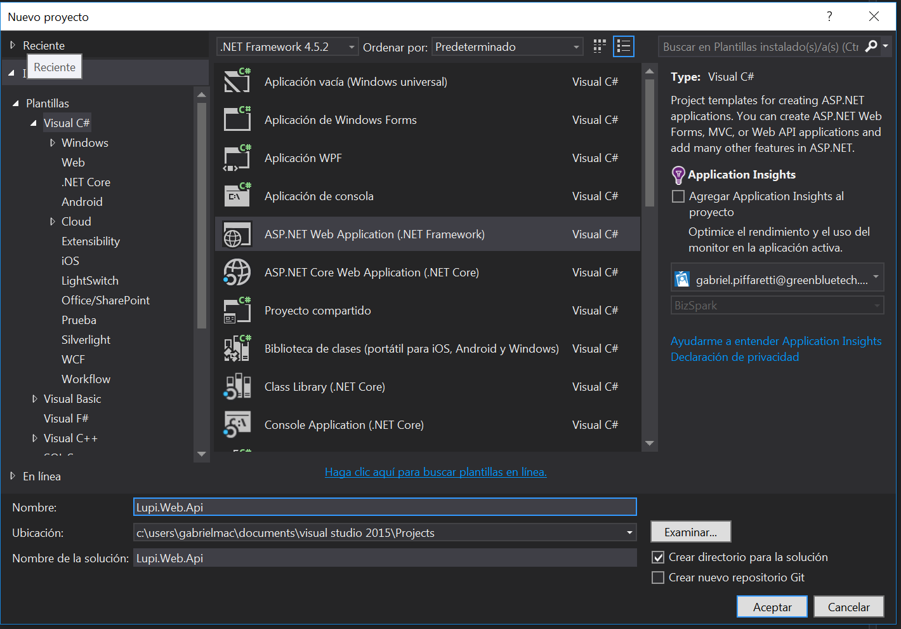
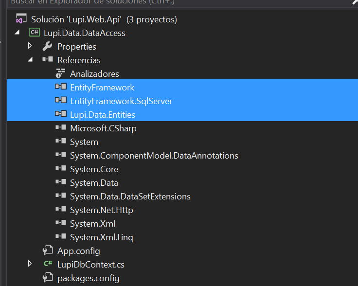
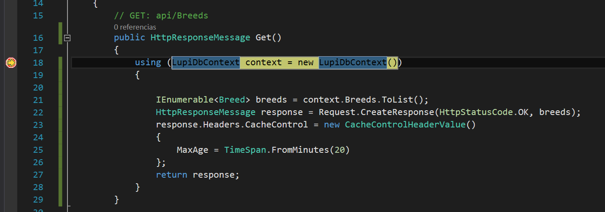

# LUPI


LUPI se basa en un pequeño dispositivo que se coloca sobre nuestras mascotas (por ejemplo sobre su collar), permitiendo tener una enormidad de datos en tiempo real sobre los mismos. Este funciona a partir de tecnología inteligente para tener un seguimiento de la ubicación y actividad de las mismas.

Tiene dos partes fundamentales: el dispositivo que se coloca sobre la mascota y la app mobile desde la cual se tiene el manejo y seguimiento de los datos enviados. En un futuro también se desea poder contar con una web para que los usuarios también puedan usar el sisema.

Los usuarios acceden a la web y establecen una conexión con el dispositivo sobre el collar. Para cada mascota a su vez se pueden crear perfiles, donde para cada uno recibiremos datos como temperatura,  si está agitado o descansando, su ubicación (para estar seguros de que se encuentre en donde queremos), e incluso su “visión” a partir de la implementación de una cámara en el disposiitivo. Con estos datos se podrían generar estadísticas y reportes que hablen de nuestra mascota.

## Entendiendo cómo funciona

### Arquitectura a alto nivel

A continuación se presenta un bosquejo de la arquitectura que podría modelar el sistema. Su funcionamiento es muy simple:

1) Cada mascota tiene un **collar** que sensa datos del perro y de su ambiente en tiempo real.
2) El mismo envía frecuentemente datos por bluetooth a diferentes **receptores de señales bluetooth** que se encuentran por la ciudad.
3) Los dispositivos/beacons bluetooth envían los datos a un **router** quien mediante HTTP los envía al backend de la aplicación.
4) El **Backend** interpreta, procesa y almacena los datos enviados por los collares
5) Se tiene un **Frontend** (aplicación web) que permite gestionar, mantener y visualizar la información de las mascotas, dueños, collares, entre otros.



### Arquitectura simplificada para la primer parte del curso

Para simplificar la arquitectura de este trabajo, simplemente se trabajará con la tecnología del lado del servidor. El resto de las piezas serán simuladas a partir de un cliente HTTP como lo puede ser Postman.


## Comienzo del desarrollo de LUPI

A lo largo del curso, utilizaremos el desarrollo de este producto (LUPI) como ejemplo para navegar entre las tecnologías correspondientes. Como ya dijimos, el mismo es un sistema de trackeo de la actividad de nuestras mascotas.

Para el desarrollo de hoy deberemos contar con las siguientes herramientas:

 - Visual Studio 2015 Enterprise
 - SQL Server 2012 Developer Edition
 - Cliente Postman

### Creando la estructura del proyecto

Para el desarrollo de la aplicación, deberá crearse una solución **Lupi** en Visual Studio con los siguientes proyectos:
 - **Lupi.Web.Api**: ASP.NET Web Application, con el formato vacío, importando Web API únicamente (como se muestra en las imágenes debajo)
 - **Lupi.Web.Api.Models**: Class Library
 - **Lupi.Data.Entities**: Class Library
 - **Lupi.Data.DataAccess**: Class Library




**Lupi.Data.Entities** será el proyecto en el que colocaremos nuestras entidades.

**Lupi.Data.DataAccess** será el que contenga el contexto para Entity Framework y maneje la lógica del acceso a datos.

**Lupi.Web.Api** contendrá los servicios que expondremos a través de nuestra API REST.

**Lupi.Web.Api.Models** incluirá los modelos de las entidades. Esto último se debe a que no queremos acoplar nuestra api a nuestro modelo de dominio, por lo que generaremos lo que se conoce como DTO (DataTransferObjects). Estos objetos permitirán enviar únicamente los datos que deseo, además de moldearse mejor a las necesidades de la API REST, sin las restricciones de EntityFramework.

### Agregando nuestro dominio

En el proyecto Lupi.Data.Entities, crearemos las entidades reflejadas en el siguiente diagrama.

Para entender un poco más el problema se comenzó analizando los diferentes participantes del mismo. La idea se basa en que los usuarios puedan tener control sobre sus mascotas (dónde se encuentra, si está fatigada, etc.), por lo que los dos participantes más “importantes” son las mascotas y los dueños. Toda la información que el dueño quiere obtener de su mascota debe ser obtenida y enviada hasta él por lo que se necesita un intermediario. Éste último es el collar, ya que se encarga de tomar todos los datos.

La realidad es que un dueño puede tener varias mascotas y la aplicación debe permitirlo, de la misma forma asumimos (para simplificar) que las mascotas tienen un único dueño. Entonces, un dueño puede poseer varios collares, donde a cada uno de éstos puede estar asignado como mucho a una mascota. Para permitir el intercambio de collares entre perros, en caso de que el dueño tenga más perros que collares, un perro puede no tener asignado un collar así como un collar puede no tener ningún perro.

Se adjunta un modelo de dominio de que podría modelar lo descrito anteriormente:


### Agregando el acceso a datos

A continuación, debemos agregar Entity Framework al proyecto de DataAccess. Una vez agregado, debemos crear la clase LupiDbContext en DataAccess, y agregarle una referencia al proyecto de Lupi.Data.Entities para poder utilizar las entidades.


```C#

using System.Data.Entity;
using System.Linq;
using System.Text;
using System.Threading.Tasks;

namespace Lupi.Data.DataAccess
{
    public class LupiDbContext : DbContext
    {
        public DbSet<Breed> Breeds { get; set; }
        public DbSet<Base64Image> Images { get; set; }
        public DbSet<Collar> Collars { get; set; }
        public DbSet<Owner> Owners { get; set; }
        public DbSet<Pet> Pets { get; set; }
    }
}

```



### Creando el primer Controller - Breeds

Estudiemos en primer lugar la estructura del proyecto. Discutir con el docente en clase.


Antes de crear el controlador, debemos diseñar la api que vamos a exponer, dada la clase que queremos exponer.
Luego debemos pensar las acciones que efectuaremos sobre las razas: 
- Obtener todas las razas (o un subconjunto de las mismas)
- Obtener uno en particular
- Crear una
- Actualizar sus datos
- Borrar una raza

|     URI     | Verbo | Descripción |
|-------------|-------|-------------|
|/api/breeds   | GET   |Obtener una lista de todas las razas|
|/api/breeds   | POST  |Crear una raza|
|/api/breeds/1 | GET   |Obtener los datos de la raza 1|
|/api/breeds/1 | PUT   |Actualizar los datos de la raza 1|
|/api/breeds/1 | DELETE|Eliminar la raza 1|

Teniendo entonces las uris definidas, debemos crear una clase que nos permita exponer estos métodos. Para ello, debemos crear un controlador. 

** Un _controlador_ es un objeto que maneja los pedidos HTTP.**

Para crear el primer controlador, debemos seleccionar nuestro proyecto de Web API, y seleccionar con el botón derecho la carpeta Controllers. Allí seleccionamos la opción de Agregar Item > Controller. Esto abrirá el diálogo para la creación de un controller. Seleccionamos la opción de crear un controlador (puede ser vacío o con operaciones de lectura y escritura) y el nombre sera **BreedsController**.


Se creará la siguiente clase:

```C#
using System.Web.Http;

namespace Lupi.Web.Api.Controllers
{
    public class BreedsController : ApiController
    {
        
    }
}
```

En Web Api, los controladores heredan de una clase llamada ApiController. En MVC, heredan de la clase Controller.

Los controladores en ASP.NET Web API retornan lo que se conoce como Action Results. 
Una acción de un controlador puede retornar cualquiera de las siguientes opciones:
1. ```void```
2. ```HttpResponseMessage```
3. ```IHttpActionResult```
4. Cualquier otro tipo.

Dependiendo el retorno, el framework utiliza un mecanismo diferente para crear la respuesta HTTP.

| Tipo de retorno | Mecanismo de creación de la respuesta |
|-----------------|---------------------------------------|
| ```void``` | Retorna código 204 (Sin Contenido) |
| ```HttpResponseMessage``` | Convierte directamente a un mensaje de respuesta HTTP |
| ```IHttpActionResult``` | Llama a ```ExecuteAsync``` para crear la ```HttpResponseMessage```, y luego convertirlo en el mensaje de respuesta HTTP |
| Cualquier otro tipo. | Escribe el valor de retorno serializado dentro de una respuesta 200 (OK) |


En todos los casos, el framework utiliza formateadores para serializar el valor de retorno. Dependiendo del header Accept de la solicitud, será el formato en que retorne. (JSON, XML, etc.)

Estudiaremos las opciones 2 y 3.

#### ```HttpResponseMessage```
Esta opción brinda mucho control sobre el mensaje de respuesta, permitiendo ingresar headers particulares, o modificar el formato del contenido.

Por ejemplo, si queremos controlar el header de cache, para devolver los usuarios, el método sería:

```C#

 public HttpResponseMessage Get()
 {
     using (LupiDbContext context = new LupiDbContext())
     {

         IEnumerable<Breed> breeds = context.Breeds.ToList();
         HttpResponseMessage response = Request.CreateResponse(HttpStatusCode.OK, breeds);
         response.Headers.CacheControl = new CacheControlHeaderValue()
         {
             MaxAge = TimeSpan.FromMinutes(20)
         };
         return response;
     }
 }
```

Probando con un Postman:

1) Escribimos la llamada a la API.


2) Vemos como se ejecuta



3) Vemos el resultado de la ejecución en el Postman


#### ```IHttpActionResult```

Con esta opción, obtenemos una mayor flexibilidad a la hora de realizar los mensajes de respuesta. En general usaremos las implementaciones de esta clase disponibles en [System.Web.Http.Results](https://msdn.microsoft.com/en-us/library/system.web.http.results.aspx). La clase ```ApiController``` define métodos uqe permiten retornar estos resultados. Para retornar algo similar a lo visto con ```HttpResponseMessage```, el código quedaría de la siguiente manera.

```C#

public IHttpActionResult Get()
{
    IEnumerable<Breed> breeds;
    
    using(LupiDbContext context = new LupiDbContext())
    {

        breeds = context.Breeds.ToList();
    }
    
    if(breeds == null)
    {
        return NotFound();
    }
    return Ok(breeds);
}
```

En caso de desearlo, es posible implementar la interfaz para obtener mensajes de respuestas personalizados. En caso de desearlo, deberán investigar por su cuenta cómo realizarlo.

### Ruteo por atributos

_Routing_ es la manera en que Web API conecta una URI a una acción de un controlador. En Web API 2 se introduce lo que se conoce como _attribute routing_ que, como indica su nombre, utiliza los atributos para definir rutas. Esto brinda más control sobre las URIs. 
En la primer versión del framework, se utilizaba lo que se conoce como _convention routing_. Para utilizarlo, se definían templates de rutas (strings parametrizados), y luego el framework emparejaba una uri con el tamplate para decidir qué acción ejecutar. Sin embargo, este tipo de routing dificultaba utilizar algunos patrones comunes en APIs REST, como objetos con relaciones. Ej: Las tareas de un usuario.

Para activar _Attribute Routing_, hay que llamar a MapHttpAttributeRoutes durante la configuración de la aplicación. Para ello, modificamos el WebApiConfig, de la siguiente manera:

```C#

using System.Web.Http;

namespace WebApplication
{
    public static class WebApiConfig
    {
        public static void Register(HttpConfiguration config)
        {
            // Web API routes
            config.MapHttpAttributeRoutes();

            // Other Web API configuration not shown.
        }
    }
}

```

Podemos mantener las rutas por convención si así lo deseamos, quedando:

```C#

using System.Web.Http;

namespace WebApplication
{
    public static class WebApiConfig
    {
        public static void Register(HttpConfiguration config)
        {
            // Web API routes
            config.MapHttpAttributeRoutes();

            // Convention-based routing.
            config.Routes.MapHttpRoute(
                name: "DefaultApi",
                routeTemplate: "api/{controller}/{id}",
                defaults: new { id = RouteParameter.Optional }
            );
        }
    }
}

```

#### Agregando atributos de ruta

Veamos un ejemplo de una ruta definida usando un atributo


```C#

public class BreedsController : ApiController
{

    [Route("breeds/{breedId}")]
    [HttpGet]
    public Breed FindBreedByID(Guid breedId)
    {
        //Código para obtener la raza.
    }
}

```

El string definido luego de la etiqueta Route es el template de URI para la ruta. 
Al recibir un request, Web API intenta igualar la URI entrante con el template. En este caso, "breeds" es un segmento literal, y "{breedId}" es un parámetro variable.

Para poder restringir lo que se pasa en los parámetros, se usan las **restricciones**, las cuales veremos más adelante.

#### Métodos HTTP disponibles

```C#
[HttpDelete]
[HttpGet]
[HttpHead]
[HttpOptions]
[HttpPatch]
[HttpPost]
[HttpPut]

```

Cree la funcionalidad necesaria para soportar métodos especificados.

### Probando la aplicación con POSTMAN

Acceder a [postman](https://www.getpostman.com/) y probar las funcionalidades creadas.

### Moviendo la lógica a servicios
Tener los métodos con lógica dentro de los controladores no parece la mejor opción. Además, nuestra api depende del paquete de Entities, algo que nos propusimos evitar desde el principio. Para lograrlo, crearemos un nuevo proyecto: Tresana.Web.Services.
En el proyecto de Services, incluiremos una referencia a Entities y a DataAccess, y serán los encargados de manejar la lógica de negocio de nuestra aplicación.

#### Ejercicio:

Mueva la lógica de las acciones del controller de usuarios a un BreedsService o BreedsBusinessLogic.
